<p align="center">
  
</p>

# pnCore — v0.18.8

pnCore is an MCP server and Cursor plugin. It runs software delivery as a sequence of named, gated steps instead of one long chat.

<p align="center">
  
</p>

It ships discovery, planning, skeptic challenge, design, audits, assets, and delivery through a deterministic `workflow_step` engine — backed by skills, agents, rules, and `pn-core://` resources, not a folder of prompts.

**Catalog:** 170 skills, 9 public agents + 6 internal orchestration agents, 31 visible slash palette files (30 under **`pn`** submenu + **`/pn`** stub) + 18 palette-hidden surgical commands (49 command files total), 27 MCP tools, 16 workflow types, plus `pn-core://` resources and prompts.

---

## Why this exists

<p align="center">
  
</p>

A single chat can plan a feature, write the code, and tell you it's done — but there's no checkpoint in between. If it goes sideways on step three, you're rereading the whole transcript to find out where. Asking it to redo one part usually means starting the conversation over, and whatever context got it that far is gone.

pnCore moves that step list out of the chat. `workflow_step(type, index, state)` runs one step at a time — discovery, plan, build, review — and hands back the next instruction. A skeptic pass, a human gate, or `workflow_verify` decides whether a step actually passed, not the model's own say-so. If you get disconnected, `workflow_state_save` and `workflow_state_load` pick the run back up where it left off.

---

## What it is

**Deterministic.** `workflow_step(type, index, state)` decides the next instruction. Steps aren't skipped by assumption — skipping one is a gate decision, logged in state.

**Gated.** Skeptic, human, and `workflow_verify` gates are built into the engine. Intent is `full auto`, `design focused`, or `involved` — involved means you approve discovery, plan, specialists, and review before they run.

**Multi-surface.** One canonical tree in `packages/pn-core-mcp/content/`. The MCP runs the engine in any client. The Cursor plugin adds the `/` palette, file-glob rules, agent selector, and stop hook. Pi registers the same 27 tools natively.

**Resumable.** Every run has a `run_id`. Handoff lines and usage land in JSONL. After a disconnect, load state and continue the same step list.

<p align="center">
  
</p>

---

## Install

**Prerequisite:** Node.js 22+.

Call `health` first — it should return version, `calendarDateUtc`, and capabilities. If it doesn't, nothing downstream (skills, agents, `workflow_step`) will load either.

<a id="mcp-any-mcp-client"></a>

### Cursor — MCP (one-click)

[](https://cursor.com/en/install-mcp?name=pn-core&config=eyJjb21tYW5kIjoibnB4IiwiYXJncyI6WyIteSIsIi0tcGFja2FnZT1naXQraHR0cHM6Ly9naXRodWIuY29tL3Blcm5pZW1hbm4vcG5Db3JlLmdpdCNtYWluIiwiLS0iLCJwbi1jb3JlIl0sImVudiI6eyJHSVRfVEVSTUlOQUxfUFJPTVBUIjoiMCIsIkdJVF9BU0tQQVNTIjoiZWNobyJ9fQ==)

Or add manually to `~/.cursor/mcp.json`:

```json
{
  "mcpServers": {
    "pn-core": {
      "command": "npx",
      "args": ["-y", "--package=git+https://github.com/perniemann/pnCore.git#main", "--", "pn-core"],
      "env": { "GIT_TERMINAL_PROMPT": "0", "GIT_ASKPASS": "echo" }
    }
  }
}
```

`GIT_TERMINAL_PROMPT=0` and `GIT_ASKPASS=echo` fail fast when git cannot authenticate (missing credentials, rate limit, or a bad URL). Without them, a credential prompt on piped stdin leaves Cursor in a forever loading state.

### Cursor — Plugin

From your **target project** directory:

```bash
npx github:perniemann/pnCore plugin-install
```

Copies commands, rules, skills, agents, config, and hooks into `.cursor/` and `.cursor-plugin/`. Reload Cursor, then run `/pn-new`.

> **MCP or plugin?** MCP is the engine. The plugin is the Cursor surface (slash palette, rules, agents, stop hook). The intended Cursor setup is both. Details: [Plugin vs MCP](packages/pn-core-mcp/README.md#plugin-vs-mcp).

### pi.dev (Pi coding agent)

```bash
pi install git:github.com/perniemann/pnCore@main
```

Pi surfaces a single **`/pn`** entry. Direct invoke: `/pn pn-build`. Native tools ship with `pi install git:…/pnCore` or `pi install .` from this repo root after `npm run build:mcp`. Cursor and Claude Code still use the stdio MCP server. See [ADR-0008](docs/adr/0008-command-palette-pn-submenu.md) and [ADR-0009](docs/adr/0009-pi-native-tools.md).

### Claude Code

Use the same MCP JSON. Settings → MCP Servers, paste the block, enable it. See [Anthropic's MCP documentation](https://docs.anthropic.com/en/docs/claude-code/mcp).

Windows, Cloud Agents, this-checkout `node` paths, and first-npx timeouts: [packages/pn-core-mcp/README.md](packages/pn-core-mcp/README.md#installation). Clone-and-develop: [CONTRIBUTING.md](CONTRIBUTING.md).

---

## Quick start

1. Install MCP and/or plugin (above).
2. Call `health` — version, UTC date, capabilities.
3. **New repo or greenfield:** `/pn-new` or `workflow_step("project_kickoff", 0, {})` — discovery, refs, PRD, and design docs under `docs/refs/`.
4. **Build or extend:** `/pn-build` or `workflow_step("full_dev", 0, {})` — skips kickoff when the project already has context.
5. Before ship: `/pn-deliver` or `/pn-frontend-audit`.

Copy-paste first message:

```
pn-new ▲

Build [your-project-name] — [one-line description].
References: [path or "in .ref/"] (pitch, requirements, design assets).
Analyze both: prior art and design.
Intent: Involved — full gates at discovery, plan, specialists, and review.
Delivery tier: full. Design ambition: distinctive.
```

Answer Step 0: Yes, Both. Step 1: (3) Involved.

More prompts: [docs/how-to-use-guide.md](docs/how-to-use-guide.md).

---

## Workflows

<p align="center">
  
</p>

Call `list_workflow_types` for live step counts.

| Use it for | Workflow | Cursor | MCP entry |
|-------------|----------|--------|-----------|
| New project: refs, discovery, PRD, design | `project_kickoff` | `/pn-new` → Involved | `workflow_step("project_kickoff", 0, {})` |
| Build a feature or product end-to-end | `full_dev` | `/pn-build` | `workflow_step("full_dev", 0, {})` |
| Design-first UI | `design` | `/pn-design` | `workflow_step("design", 0, {})` |
| Scored frontend diagnosis + fix roadmap | `frontend_audit` | `/pn-frontend-audit` | `workflow_step("frontend_audit", 0, {})` |
| API, security, data, errors, performance | `backend_audit` | `/pn-backend-audit` | `workflow_step("backend_audit", 0, {})` |
| SVG, raster, or placeholders | `svg_create` / `image_create` | `/pn-assets` | `workflow_step("svg_create" \| "image_create", 0, {})` |
| Evidence-led strategy brief | `business_strategy` | `/pn-strategy` | `workflow_step("business_strategy", 0, {})` |
| Competing implementations (2–3 worktrees) | `implementation_tournament` | `/pn-best-of-n` (`bestOfN.enabled: true`) | `workflow_step("implementation_tournament", 0, {})` |
| Multi-slice hierarchical build | `feature_program` | `/pn-program` (preview; `featureProgram: true`) | `workflow_step("feature_program", 0, {})` |

Also on the engine: `visual_tweak`, `prompt_optimize`, `game_feature`, `engine_feature` (Unreal / Godot), `fsi_analyst_draft`, `media_director`. Full table and aliases: `list_workflow_types`.

### Example: `full_dev`

| # | Who | Action |
|---|-----|--------|
| 1 | You | `/pn-new` or "Start a new project with full dev workflow." Choose **full auto**, **design focused**, or **involved**. |
| 2 | Agent | `workflow_step("full_dev", 0)` — discovery: purpose, users, stack, references, existing code. |
| 3 | Agent | Prior-art and research pass for your stack. |
| 4 | Agent | `workflow_step("full_dev", 2)` — roadmap, phases, architecture, plan under `docs/plans/`. |
| 5 | You | Review plan. **Involved** intent runs skeptic challenge; approve before build. |
| 6 | Agent | `workflow_step("full_dev", 3)` — specialist routing (frontend, backend, testing, …). |
| 7 | Agent | `workflow_step("full_dev", 4)` — specialists build; UI assets created when in scope. |
| 8 | Agent | Optional merge phase (`mergePhaseFullDev`): reconcile parallel work, verify build. |
| 9 | Agent | `workflow_step("full_dev", 5)` — review + optimize against the plan. |
| 10 | You | `/pn-deliver` for handoff pack, or `/pn-frontend-audit` for a scored quality gate. |

Tool steps are 0-based. Resume after disconnect: `workflow_state_save` then `workflow_state_load`. Schema: `pn-core://reference/workflow-state-schema.md`.

**Design-first:** `workflow_step("design", 0)` instead of `full_dev`. Load `.pncore-design.md` via `/pn-setup`.

**Game / 3D:** `workflow_step("game_feature", 0)` for feature loops. For full builds, use `full_dev` and name the stack in discovery.

---

## What changes

| Without pnCore | With pnCore |
|-----------------|-------------|
| One long transcript | Named steps, each with a `run_id` |
| "Done" means the model stopped talking | Skeptic, `workflow_verify`, or a delivery pack decide |
| A retry starts a new chat | `workflow_state_load` picks up where it stopped |
| Skills live in a folder you have to remember to load | The engine loads gates and skills automatically |
| Works in Cursor chat, nowhere else | MCP runs in any client; Pi has native tools |

**Three tier concepts** (do not conflate them): **delivery tier** (MVP/Full), **context tier** (1–4 reading depth), **model tier** (`fast` / `standard` / `premium` / `premium_thinking` / `long_horizon`). Loop orchestration: `suggest_model_tier` with `role: orchestrator` → `long_horizon`. See `pn-core://reference/delivery-tier-criteria.md` and [MCP tools](packages/pn-core-mcp/README.md#tools).

Load before a build session: `pn-core://reference/best-practices.md`, `pn-core://reference/loop-orchestration-guide.md`, `pn-core://reference/aesthetics-baseline.md`, and `health` for the current UTC date.

---

## Honest edges

| Situation | What happens | What to do |
|-----------|--------------|------------|
| A one-line typo fix | The workflow overhead isn't worth it | Ask directly, skip `workflow_step` |
| Plugin without MCP | Slash templates only — no `workflow_step` engine | Install MCP for Cursor, or both |
| First npx on a git+https package URL | Cursor MCP can time out on a cold clone | Pre-warm once, then reload. Matrix: [MCP README](packages/pn-core-mcp/README.md#troubleshooting-mcp-wont-connect-in-cursor) |
| `feature_program` / `bestOfN` | Preview flags; off by default | Set `featureProgram: true` or `bestOfN.enabled: true` |
| Vue, Svelte, Angular, Unity | Limited support | Prefer React, Astro, Next, vanilla web, Node, Three.js / Babylon, n8n, web3 |

**Best fit:** teams building with Cursor on React, Astro, Next.js, vanilla web, Node backends, Three.js / Babylon / gamedev, n8n, and web3. Inventory: [docs/plugin-reference.md](docs/plugin-reference.md).

---

## Documentation

| Guide | What's in it |
|-------|-------------|
| [docs/how-to-use-guide.md](docs/how-to-use-guide.md) | Copy-paste prompts, example flows, MCP-only bootstrap |
| [docs/mcp-usage-guide.md](docs/mcp-usage-guide.md) | MCP tools, resources, workflow patterns, state/handoff |
| [docs/plugin-reference.md](docs/plugin-reference.md) | Rules, skills, agents, commands, hooks |
| [packages/pn-core-mcp/README.md](packages/pn-core-mcp/README.md) | MCP config, 27 tools, env vars, error codes, resources |
| [docs/companion-mcp-catalog.md](docs/companion-mcp-catalog.md) | Companion MCPs (Octocode, Stripe, n8n, …) |
| [docs/pitch-to-app-example.md](docs/pitch-to-app-example.md) | End-to-end pitch-to-app walkthrough |
| [packages/pn-core-mcp/content/docs/starting-new-project.md](packages/pn-core-mcp/content/docs/starting-new-project.md) | Kickoff and `docs/refs/` setup |
| [CONTRIBUTING.md](CONTRIBUTING.md) | Workspace map, scripts, PR workflow, ADR policy |
| [plugins/pnCore/CHANGELOG.md](plugins/pnCore/CHANGELOG.md) | Release history |

---

## Scripts

Contributor scripts, local MCP config, and how to develop pnCore live in [CONTRIBUTING.md](CONTRIBUTING.md#scripts). Repo layout: [docs/folder-structure.md](docs/folder-structure.md).

---

## License

MIT — see [LICENSE](LICENSE).
