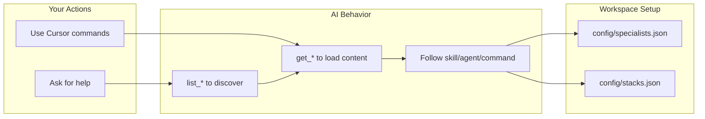

# pn-core MCP: Analysis and Usage Guide

## What pn-core MCP is

pn-core is the **MCP server** for the pnCore plugin pack. It exposes skills, agents, commands, rules, and a deterministic **`workflow_step`** engine as **24 tools**, plus **`pn-core://` resources** and **MCP prompts** (see below). Stacks and scope limits: [plugin reference](plugin-reference.md). **Orientation** (plugin vs MCP, slash commands, when to use which workflow): [How to use pnCore](how-to-use-guide.md).

**Reference:** Env vars, tool risk labels, and structured error codes are documented in [packages/pn-core-mcp/README.md](../packages/pn-core-mcp/README.md). This guide focuses on usage patterns.

---

## The 24 tools: who uses them and how

| Tool | Purpose | Who uses it |
|------|---------|-------------|
| `health` | Status, version, **`calendarDateUtc`** / **`timestampUtc`** (server clock, UTC), capability summary | Gateways, probes, **dating changelogs or "as of" lines** |
| `list_workflow_types` | List workflow types and step counts: `project_kickoff`, `design`, `full_dev`, `prompt_optimize`, `frontend_audit`, `backend_audit`, `image_create`, `visual_tweak`, `game_feature`, `svg_create`, `engine_feature`, `unreal_feature`, `godot_feature`, `fsi_analyst_draft`, `business_strategy`, `media_director`, `feature_program` | AI (discoverability) |
| `suggest_model_tier` | Suggested LLM model tier for a workflow step (`fast` / `standard` / `premium` / `premium_thinking`); omit `step` for the full per-step table | AI |
| `list_skills` | List skill ids + descriptions | AI |
| `get_skill` | Load full markdown of a skill by id | AI |
| `list_agents` | List agent ids + descriptions | AI |
| `get_agent` | Load full markdown of an agent by id | AI |
| `list_commands` | List command ids + descriptions | AI |
| `get_command` | Load full markdown of a command by id | AI |
| `list_rules` | List rule ids + descriptions | AI |
| `get_rule` | Load full markdown of a rule by id | AI |
| `workflow_step` | Deterministic workflow engine: one instruction per step for all types returned by `list_workflow_types`; validates state; enforces gates (discovery, skeptic, audits, etc.). With `PNCORE_REQUIRE_APPROVAL_FOR_WORKFLOWS`, human gates need `pncoreHumanGateTicket` in state | AI |
| `report_usage` | Report token/cost usage for a workflow step; optional append to JSONL under cwd | Client / AI |
| `workflow_usage_totals` | Sum `inputTokens`, `outputTokens`, and optional `costUsd` for a workflow `run_id` from a usage JSONL file (tail scan for safety) | AI / Client |
| `workflow_handoff_append` | Append a bounded step summary line for cross-session handoff (same `run_id` as `workflow_step`) | AI / Client |
| `workflow_handoff_read` | Read recent handoff lines for a `run_id` (e.g. new chat restore) | AI / Client |
| `workflow_state_save` | Persist workflow state to file for resume after disconnect | AI / Client |
| `workflow_state_load` | Load workflow state from file | AI / Client |
| `workflow_confirm` | Structured confirmation gate (MCP-only `ask_question` approximation). Returns prompt + options; model outputs them and stops until user replies | AI (gates when ask_question unavailable) |
| `approval_checkpoint` | Hard gate: succeeds only if `approval_token` matches `PNCORE_APPROVAL_TOKEN` on the MCP server (`env` in MCP config). Optional `workflow_type` + `workflow_step` issue `pncoreHumanGateTicket` for opt-in mandatory human gates | AI + user (high-risk steps) |
| `gate_log_append` | Append-only gate audit line (JSONL), default `.pncore/gate-log.jsonl` | AI / ops audit |
| `paperclip_issue_checkout` | Check out a Paperclip issue before starting work. Requires PAPERCLIP_API_URL and PAPERCLIP_API_KEY; optional PAPERCLIP_ISSUE_ID when `issueId` is omitted | AI |
| `paperclip_issue_comment` | Post a markdown comment on an issue. Same env; optional default issue id | AI |
| `paperclip_issue_update` | PATCH issue status (e.g. mark done when a workflow completes). Prefer checkout for `in_progress` per pn-paperclip | AI |

**List vs get:** Use **list_*** (`list_skills`, `list_agents`, `list_commands`, `list_rules`) to discover ids and short descriptions. Use **get_*** (`get_skill`, `get_agent`, `get_command`, `get_rule`) to load the full markdown content by id. Discovery first, then load.

**Important:** These tools are **AI-facing**. They are called by the model to pull guidance when it's needed. You don't need to call them yourself.

**ask_question (Cursor-specific):** Skills and commands instruct the AI to use Cursor's `ask_question` tool when available for questionnaires and confirmation gates (structured options, proceed/yes/no). When using pn-core MCP from a client that does not expose `ask_question` (e.g. MCP-only, non-Cursor IDE), the AI uses `workflow_confirm` for gates (returns formatted prompt + options) or outputs questions in chat. For gates: call `workflow_confirm`, output the prompt, then stop until you reply. You may get plain-text questions instead of structured prompts.

**Hard approval and mandatory human gates:** Configure `PNCORE_APPROVAL_TOKEN`, optional `PNCORE_REQUIRE_APPROVAL_FOR_WORKFLOWS`, and ticket path `PNCORE_HUMAN_GATE_TICKETS_PATH` as documented in [packages/pn-core-mcp/README.md](../packages/pn-core-mcp/README.md). `approval_checkpoint` verifies the token; prompt-only gates do not prove the server secret.

**Gate audit log:** Use `gate_log_append` to record outcomes (`outcome`, `gate_type`, etc.) append-only for review.

### workflow_step: deterministic control flow

When `workflow_step` is available, use it for build/design flows instead of loading commands manually. Control flow lives in the tool; the model assists each step but cannot skip steps or decide sequence on its own.

| workflowType | Step indices (inclusive) | Purpose |
|--------------|---------------------------|---------|
| `project_kickoff` | 0–7 | Discovery → **`docs/refs/`** PRD / DESIGN-DOC / optional DOMAIN-DOC → prior art → optional stack/MCP/UI in **`docs/refs/`** → **`docs/refs/README.md`** → project context. No plan or **`docs/WORKFLOW.md`** in this workflow. See [starting-new-project.md](../packages/pn-core-mcp/content/docs/starting-new-project.md). |
| `design` | 0–5 | Design questionnaire → Plan+Skeptic → Assets → Build → Skeptic on output → Summary |
| `full_dev` | 0–6 | Discovery → Prior art → Plan+Skeptic → Route specialists → Run specialists → Review+Skeptic → Summary |
| `prompt_optimize` | 0–2 | Questionnaire → Draft + review → Final prompt |
| `frontend_audit` | 0–2 | Scope → Phase 1–6 audit → summary |
| `backend_audit` | 0–6 | Scope + stack → five audit phases → summary |
| `image_create` | 0–3 | Questionnaire → Spec confirmation → Generate → Summary |
| `visual_tweak` | 0–3 | Target → Plan → Implement → Summary |
| `game_feature` | 0–4 | Questionnaire → Plan+Skeptic → Implement → Skeptic on output → Summary |
| `svg_create` | 0–4 | Questionnaire → Spec + confirmation → Generate → Skeptic on output → Summary |
| `engine_feature` | 0–4 | Unified UE / Godot entry — routes to `unreal_feature` or `godot_feature` via `state.engine`. Old direct types remain as 2-release deprecation aliases. |
| `unreal_feature` | 0–4 | UE version + MCP server pick (pn-unreal-mcp) → api-probe + plan + skeptic → Build via chosen UE MCP server → render-verify (UE 5.7 appendix) + skeptic on output → Summary |
| `godot_feature` | 0–4 | Godot version + MCP server pick (pn-godot-mcp) → api-probe + plan + skeptic → Build via chosen Godot MCP server → render-verify (Godot appendix) + skeptic on output → Summary |
| `fsi_analyst_draft` | 0–5 | Scope → sources + assumptions → draft (deliverable-typed FSI skill) → QC + skeptic → mandatory analyst sign-off (human gate) → delivery summary |
| `business_strategy` | 0–8 | Framing → codebase intake (conditional) → evidence → strategic frame → grill → pressure-test (Strong / Weak / Pivot, iteration cap=2) → conditional skeptic → verdict lock → HTML + markdown brief |
| `media_director` | 0–6 | Intent → adaptive grill (blank / <10-char / contradictory triggers) → creative brief (`docs/media/<slug>-brief.md`) → plan + pipeline + skeptic → produce → human review → delivery summary |

`list_workflow_types` reports a **steps** count per workflow; **`step`** passed to `workflow_step` is **0-based** through **`steps − 1`** (inclusive), matching the indices in this table.

**`design` workflow — failed skeptic-on-output:** At step **4** (skeptic on output), if the client calls `workflow_step("design", 4, state)` with **`skepticOutputPassed: false`**, the tool returns **`nextStep: 3`** and an instruction to increment **`iterationCount`** in state and rebuild. When **`iterationCount >= 2`** and skeptic still fails without **`iterationCapApproved: true`**, the tool returns an **`error`** directing the client to **`approval_checkpoint`** (then pass **`pncoreHumanGateTicket`** and **`iterationCapApproved: true`** on the next attempt). See **`pn-core://reference/workflow-state-schema.md`**. Command **`pn-design`** references skills **`pn-api-probe`** (optional, before plan) and **`pn-render-verify`** (before skeptic for visual artifacts).

**`unreal_feature` workflow — failed skeptic-on-output:** Same iteration-cap pattern as `design`, applied at step **3** (render-verify + skeptic on output). When `skepticOutputPassed: false`, the tool returns **`nextStep: 2`** with an instruction to increment `iterationCount` and rebuild via the chosen UE MCP server. When `iterationCount >= 2` without `iterationCapApproved: true`, the tool returns an error requiring `approval_checkpoint` with `workflow_type: "unreal_feature", workflow_step: 3`. Step 0 loads **`pn-unreal-mcp`** to compare and pick the UE MCP server; step 1 runs **`pn-api-probe`** with the UE 5.7 probe targets (Python module, EditorScriptingUtilities drift, K2Node deprecations); step 3 runs **`pn-render-verify`** with the UE 5.7 appendix (Lumen, Nanite, Blueprint compile, World Partition, MetaSounds, Niagara, PIE-vs-standalone traps).

**Usage:** Call `workflow_step(workflowType, step, state)` at start and after each step. The tool returns `instruction`, `nextStep`, `requiredInputs`, and `gate` (`human` = wait for user reply before next call). If state is missing required fields, the tool returns an error: "Complete step N first." Users say natural-language prompts like "Build X. Use the design workflow." or "Audit this frontend with the frontend audit workflow."; the model translates to tool calls.

**Fallback when workflow_step is unavailable:** Use `get_command` for the matching slash command (`pn-new`, `pn-design`, `pn-build`, `pn-frontend-audit`, `pn-backend-audit`, `pn-assets`, `pn-game`, etc.); see `pn-build-gate`. Command markdown mirrors intent; control flow is model-driven without the tool.

---

## Resources: config, reference, and schemas

Resources expose config and reference content that agents and commands refer to. When your workspace lacks these files (e.g. in non-pnCore projects), the AI can fetch them by URI instead of relying on workspace paths. URIs match [`resourceDefs` in `packages/pn-core-mcp/src/content.ts`](../packages/pn-core-mcp/src/content.ts).

| URI | Description |
|-----|-------------|
| `pn-core://config/features.json` | Feature flags for MCP workflows (merged with `PNCORE_FEATURES` env) |
| `pn-core://config/specialists.json` | Specialist agents and scaffold mappings |
| `pn-core://config/stacks.json` | Supported stacks and their rules, scaffolds, agents |
| `pn-core://reference/FLOW.md` | Standard and strict flow for pn-build, pn-project-builder |
| `pn-core://reference/DECISION_LOGIC.md` | Skeptic intensity and gating logic |
| `pn-core://reference/RUNBOOK.md` | One-page runbook: workflow_step vs get_command, skeptic gates |
| `pn-core://reference/workflow-state-schema.md` | Workflow state schema and task contract |
| `pn-core://reference/best-practices.md` | Best practices checklist (a11y, security, performance, design, orchestration, mobile, WebXR) |
| `pn-core://reference/aesthetics-baseline.md` | Distinctive UI dimension checklist, inspiration presets, optional `<frontend_aesthetics>` block for CLAUDE.md |
| `pn-core://reference/best-practice-2026-03.md` | **Legacy alias** — same resource as `best-practices.md` |
| `pn-core://reference/delivery-tier-criteria.md` | MVP vs full delivery tier criteria; used by pn-verify-acceptance |
| `pn-core://reference/parallel-rules.md` | File ownership and merge requirements for parallel specialist phases |
| `pn-core://reference/human-facing-artifacts.md` | HTML vs canvas vs markdown for subset workflow deliverables; orchestration digest rule; example gallery link |
| `pn-core://reference/discovery-and-plan-format.md` | Format reference for discovery specs and plans |
| `pn-core://reference/schemas/delivery_pack.contract.json` | Delivery pack contract schema |
| `pn-core://reference/schemas/orchestrator.contract.json` | Orchestrator contract schema (full_dev, pn-project-builder) |
| `pn-core://reference/schemas/skeptic.contract.json` | Skeptic verdict contract schema |
| `pn-core://reference/schemas/verifier.contract.json` | Verifier contract schema (pn-verify-acceptance) |
| `pn-core://reference/schemas/builder.contract.json` | Builder contract schema |
| `pn-core://reference/schemas/fix_tasks.contract.json` | Fix tasks contract schema (CI/fix flows) |

**When to use:** Prefer resources when the workspace does not have `config/` or `reference/` at the root. Tools remain for on-demand fetch of skills, agents, commands, and rules by id.

## Prompts

The server registers an MCP **prompt** for every **agent** id and for every **command** id that does **not** share an id with an agent. Optional argument **`context`** is appended to the prompt body. The template content is the same markdown returned by **`get_agent`** / **`get_command`** for that id. **Deduplication:** If an agent and a command would share the same id, only the **agent** prompt is registered.

## Deployment

pn-core uses stdio transport for local, per-user use. For remote or shared deployments, see the MCP specification for transport options (e.g. Streamable HTTP).

---

## What's inside the content

Skills, agents, commands, and rules ship as markdown under `packages/pn-core-mcp/content/`. **Counts change every release**—use **`list_skills`**, **`list_agents`**, **`list_commands`**, and **`list_rules`** for the live inventory, then **`get_*`** to load by id. Examples: `pn-discovery-questionnaire`, `pn-project-builder`, `pn-new`, `pn-build-gate`, `pn-pressure-test` (startup idea critique—distinct from plan-oriented `pn-grill` / `pn-skeptic`).

---

## How to get the best use: your side

### 1. Prompt with intent

Tell the AI what you want. It will then decide when to use pn-core content:

- "Use pn-discovery-questionnaire before we build"
- "Fix my failing CI"
- "Review this Cursor plugin for submission"
- "Create an SVG logo for my brand"
- "Follow pn-project-builder for a full dev loop"
- "Pressure-test this startup idea" / `get_command("pn-pressure-test")`

The AI will call `get_skill`, `get_agent`, or `get_command` and follow that guidance.

### 2. Use Cursor commands (plugin)

If the **pnCore plugin** is installed, slash commands (`/pn-new`, `/pn-build`, `/pn-design`, etc.) load structured flows; the AI uses `workflow_step` when MCP is connected for deterministic control flow and state persistence. Full command → workflow mapping: [How to use pnCore — Example prompts by command](how-to-use-guide.md#example-prompts-by-command).

### 3. Component libraries (shadcn MCP)

For React/Next projects building UI components, **shadcn MCP** gives the AI direct access to the shadcn/ui registry and [134+ community registries](https://ui.shadcn.com/docs/directory).

**Add to your project:** Run in the project root:
```bash
npx shadcn@latest mcp init --client cursor
```
This creates/updates `.cursor/mcp.json`. Enable the shadcn MCP server in Cursor Settings.

**When installing pnCore:** Use `npm run install -- --with-shadcn` (or `node scripts/install-to-project.mjs . --with-shadcn`) to add shadcn MCP in one step.

**Use pn-ui-component-libraries skill:** The AI loads `get_skill("pn-ui-component-libraries")` for UI library recommendations and uses shadcn MCP tools when available to browse, search, and install components.

### 4. Config for orchestration

Commands like `pn-build` and the `pn-project-builder` agent expect:

- `config/specialists.json`
- `config/stacks.json`

**In this repo:** `plugins/pnCore/config/` when using the plugin (open that folder). Root `config/` for repo-root workspace.

**In other repos:** Either (a) copy them from `packages/pn-core-mcp/content/config/` (or `plugins/pnCore/config/`) to your project root, or (b) rely on MCP resources: the AI can fetch `pn-core://config/specialists.json` and `pn-core://config/stacks.json` when those workspace paths are missing.

---

## Flow overview



---

## Are you using it optimally?

| Question | Status |
|----------|--------|
| Are you prompting with clear intent? | This drives when the AI fetches and applies pn content |
| Do you use workflow_step for build/design? | When MCP is available, prefer it over get_command; control flow is deterministic |
| Do you use Cursor commands (pn-new, pn-build)? | If the plugin is installed, these give structured flows |
| Do you have config in non-pnCore projects? | Needed for orchestrator and full dev loop |
| Does the AI proactively use get_skill/get_agent? | It should when your task clearly matches a skill/agent |

**What you don't need to do:** Manually call `list_skills`, `get_skill`, etc. Those are for the AI. Your role is to describe what you want and use commands when applicable.

---

## Example usage patterns

### Starting a new project

When you have a **new project with no refs** (no **`docs/refs/PRD.md`**, no `.ref/`): run **`workflow_step("project_kickoff", 0, {})`** or **`get_command("pn-new")`**. Produces **`docs/refs/`** (PRD, DESIGN-DOC, optional DOMAIN-DOC, optional stack/MCP/UI, **`README.md`** index), **`docs/discovery/`**, **`docs/research/`**, and project context—not **`docs/plans/`** or **`docs/WORKFLOW.md`** (those come with **`full_dev`** / **`pn-writing-plans`**). Then run **`full_dev`** or **`design`**. Details: [starting-new-project.md](../packages/pn-core-mcp/content/docs/starting-new-project.md).

**Pattern 1: New project** — Use `/pn-new` or ask to run pn-new; choose intent (full auto / design focused / involved). For Involved + doc set, the MCP path is **`project_kickoff`** (8 steps). Copy-paste prompts and gating tips: [how-to-use-guide.md](how-to-use-guide.md#mcp-only-flows-no-plugin).

**Pattern 2: Fix CI**

- Ask "my CI is failing, please fix it".
- AI can call `get_skill` with `pn-ci-fix` or `pn-ci-triage` and follow that workflow.

**Pattern 3: Multi-step feature**

- Ask "add this feature following the orchestrator flow".
- AI loads `pn-project-builder` via `get_agent`, runs discovery → prior art → plan → skeptic → specialists → review.

**Pattern 4: SVG and assets**

- Ask "create an SVG logo" or use `/pn-assets`. AI loads `get_command("pn-assets")` and runs the questionnaire (SVG, raster image, or placeholder branch).
- **When UI is in scope:** Full dev and orchestrator flows automatically include `pn-assets-manager`—logos, icons, hero images, or placeholders are created even if you don't mention them.

**Pattern 5: Design loop (prefer workflow_step)**

- **What to say:** "Build [X]. Use the design workflow." or "Build [X]—I want discovery and skeptic."
- **What happens:** The model calls the workflow tool when available; it returns one instruction per step and enforces discovery and skeptic. When frontend/UI is in scope, Discovery includes expanded Design (3a–3g: structure, layout, sections, colors, typography, components, ambition). Answer all subsections for award-winning design. Otherwise use `/pn-design` or ask "run pn-design". The `pn-build-gate` rule prefers the workflow; it falls back to `get_command` when the tool is unavailable.

**Pattern 6: Frontend audit**

- **What to say:** "Audit this frontend." or "Use the frontend audit workflow." or `/pn-frontend-audit`.
- **What happens:** The model calls `workflow_step("frontend_audit", …)` when available; you scope the audit, then Phase 1–6 (typography, layout, motion, state, performance) runs with a scorecard and fix roadmap. Otherwise the AI loads `get_command("pn-frontend-audit")`.

**Pattern 7: Documentation or prompt optimize**

- **What to say:** "Format this README per pn-documentation." or `/pn-document`.
- **What happens:** AI loads `get_skill("pn-documentation")` and applies format.

**Full list:** For example prompts for every main command and workflow mapping, see [How to use pnCore — Example prompts by command](how-to-use-guide.md#example-prompts-by-command).

---

## Best practices

Prefer **`workflow_step`** for build, design, audits, and kickoff when MCP is connected; use **`list_workflow_types`** before starting. For copy-paste prompts, command→workflow mapping, and gating guidance, see [How to use pnCore](how-to-use-guide.md).

---

## MCP-only (no plugin in repo)

If you use **only** the pn-core MCP server (no plugin installed in the project), you get all skills, agents, commands, workflow_step, and resources—but Cursor will not auto-apply pn rules (build gate, proactive skill use) or run hooks, because those come from the plugin's files.

**Bootstrap rule (one-time setup):** Copy [mcp-only-bootstrap.mdc](mcp-only-bootstrap.mdc) into your **project’s** `.cursor/rules/` (create the folder if needed). Here “your project” means the **workspace you have open in Cursor** (the app you’re building), not the pnCore repo—the file must live at `<workspace-root>/.cursor/rules/mcp-only-bootstrap.mdc`. That rule tells the AI to load `get_rule("pn-build-gate")` and `get_rule("pn-mcp-proactive")` via MCP and follow them, so build/design flows and proactive skill use behave like the full plugin.

**Slash commands:** You won't have `/pn-new`, `/pn-setup`, `/pn-design`, etc. Ask in natural language instead: "run pn-new", "run pn-setup", "use the design workflow", "run pn-review".

**Continual learning:** The skill **pn-continual-learning** works via MCP: ask "update AGENTS.md from my transcripts" or "run pn-continual-learning" and the AI will load `get_skill("pn-continual-learning")` and follow its workflow (read transcripts, extract preferences/facts, merge into AGENTS.md). What you don't get without the plugin is **automatic** run-on-stop (the hook that triggers the script when you end a chat). So learning is on-demand only unless you install the script and hook yourself. See [agents-md-guide](agents-md-guide.md) for hard constraints vs learned preferences and retrieval policy.

---

## See also

- [How to use pnCore](how-to-use-guide.md) — Example prompts by command, workflows, and [best practices](how-to-use-guide.md#best-practices)
