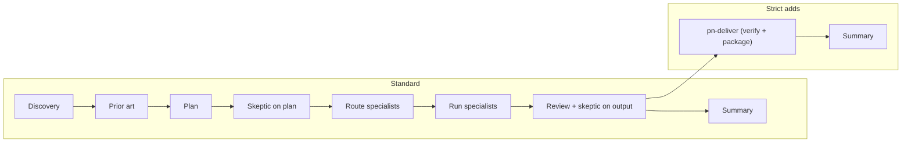

# Flow

Single pipeline implemented by pn-build and pn-project-builder. All steps use real pn skills and commands.

## Project kickoff (when no refs)

When starting a **new project** with no kickoff output (no `docs/refs/PRD.md`, no `.ref/`): run `workflow_step("project_kickoff", 0, {})` first (or use `pn-new` with Involved intent). Produces **`docs/refs/`** (PRD, DESIGN-DOC, optional DOMAIN-DOC, optional stack/MCP/UI specs, **README.md** index), **`docs/discovery/`**, **`docs/research/`**, and project context (`.cursor/rules/project-context.mdc`, `.cursor/skills/project/SKILL.md`). **Plan and `docs/WORKFLOW.md`** are not part of this workflow; they come from **`full_dev`** / **`pn-writing-plans`** after kickoff. Then run `full_dev` or `design`.

## Standard flow

1. **Discovery** — pn-discovery-questionnaire (gate on user confirmation).
2. **Prior art** — pn-prior-art-research; save to docs/research/; recommend adapt vs build.
3. **Plan** — pn-writing-plans from discovery spec and research; bite-sized tasks.
4. **Skeptic on plan** — pn-skeptic-challenge; do not run specialists until accepted.
5. **Route specialists** — From config/specialists.json; confirm list and order with user.
6. **Run specialists in order** — Apply each agent's scope, skills, and post-step review.
7. **Review+optimize** — pn-reviewer: quality gates, deslop, pn-reality-check (pn-evidence-qa optional for UI), pn-react-next-perf / pn-systematic-debugging where relevant; fix and re-run once if issues found. Then skeptic on output (pn-skeptic-challenge). Docs sync (pn-docs-sync).
8. **Summary** — Phases completed, fixes applied, pass/fail.

## Strict flow (optional)

Same as standard flow, then:

- **Deliver** — `pn-deliver`: Phase 1 verifies acceptance criteria and quality gates; Phase 2 packages results (summary, file list, how-to-test, checklist, risks, followups). Fails fast if verification does not pass.

Strict mode is "do not skip pn-deliver." Use when you need contract-grade validation and a delivery pack.

## Subagent integration (Cursor 2.5+)

When `workflow_step` returns `parallel: true` and `tasks` (specialists share a parallelGroup in config/specialists.json, or Phase B after phased Phase A), the orchestrator can use Cursor's Task tool to spawn subagents. Each subagent runs one specialist's scope; parallel execution reduces latency. Pass the specialist agent id and scope as the subagent prompt. If the list mixes parallelGroup 0 (e.g. scaffolder) with multiple group-1 specialists, run Phase A sequentially first, then re-call `workflow_step` on step 4 for Phase B parallel tasks. See pn-project-builder step 3 and pn-build step 5.

## Diagram

